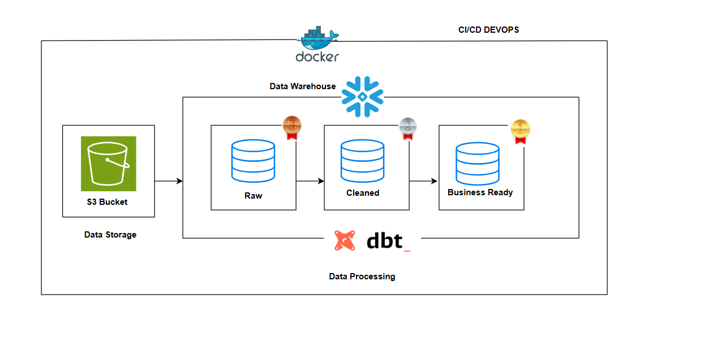
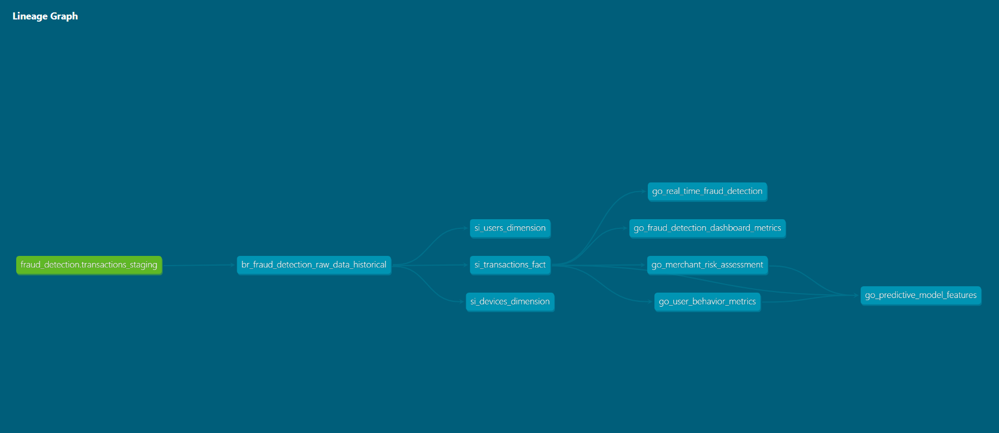
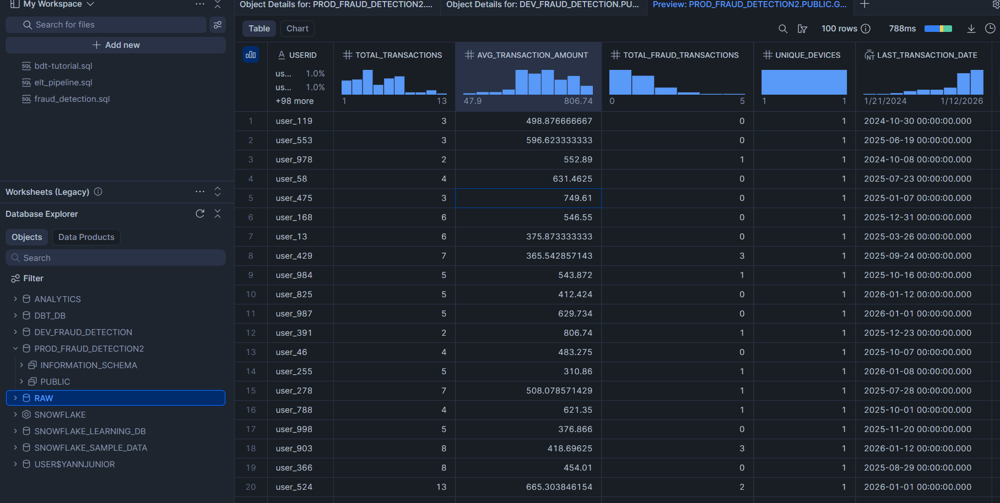

## Fraud Detection Data Pipeline Project


### 1. Project Overview

The Fraud Detection Data Pipeline Project is an end-to-end pipeline that processes raw transaction data to enable real-time fraud detection and risk assessment. The project ingests raw data into AWS S3, stages it in Snowflake, transforms it using dbt, and automates deployment through GitHub Actions, ensuring a scalable, reliable, and tested production system for fraud analysis.


### 2. Tools and Technologies Used

- **AWS S3**: Cloud storage for raw transaction data, enabling scalable and durable storage.
- **Snowflake**: A data warehouse to stage and store processed data, optimized for real-time data analysis.
- **dbt** (Data Build Tool): A transformation tool used to clean and model data, following best practices with version control and reproducibility.
- **SQL and Python**: Used within dbt models to handle transformations, testing, and data quality validation.
- **GitHub Actions**: CI/CD tool for automating testing and deployment, ensuring that all data transformations meet quality standards before being promoted to production.

### 3. Step-by-Step Process

#### Data Creation and Storage in AWS S3

The raw transaction data simulates typical attributes required for fraud detection, including details on transactions, users, devices, and anomalies. The data is uploaded to AWS S3 to provide a scalable source for both development and production environments.

Key Attributes in Sample Data

- TransactionID: Unique identifier for each transaction.
- UserID: Identifier for the user making the transaction.
- TransactionAmount: The monetary value of each transaction.
- TransactionDate: The timestamp of the transaction.
- IsFraud: Flag indicating whether a transaction is fraudulent.
- AnomalyScore: Score representing the likelihood of fraudulent behavior.
- DeviceType, LocationCoordinates, IP_Address, etc.

Data is organized in folders by year (e.g., year=2022, year=2023, year=2024) in S3 to facilitate partitioning during ingestion.

#### Staging Data in Snowflake

Once the data is uploaded to S3, Snowflake is used to stage the data. A staging table, transactions_staging, is created in Snowflake to temporarily hold this raw data.

Steps to Stage Data
1. Create Databases: Separate databases are created for development and production.

- Development Database: DEV_FRAUD_DETECTION
- Production Database: PROD_FRAUD_DETECTION2

2. Load Data from S3: Use the COPY INTO command to load data from S3 into the transactions_staging table in Snowflake.

Code Location: Refer to the staging_scripts.sql file in the snowflake folder for the full SQL code to create the databases and staging tables and to load data from S3.

#### Transforming Data using dbt

Data transformation is handled with dbt to ensure data integrity, improve performance, and prepare the data for analysis. The transformation process includes defining and creating models (tables) that represent both dimensions and facts in the fraud detection pipeline.

Setting Up the dbt Environment
- Create Virtual Environment: To isolate the environment and manage dependencies.

Commands:
```bash
python -m venv dbt-env
source dbt-env/Scripts/activate
pip install dbt-snowflake
dbt --version
```

- Initialize dbt Project: Initializes a new dbt project directory and configuration.

Command: 
```bash 
dbt init my_fraud_detection_project 
```

dbt Commands for Transformation
Once dbt is set up, use the following commands to manage and run dbt models:

Verify dbt Connection: Tests the connection to the data warehouse.

Command:  
```bash 
dbt debug 
```
Run dbt Models: Executes all transformations in the dbt project.

Command: 
```bash 
dbt run  
```
Run dbt Tests: Executes tests defined in the project to verify data quality.

Command:  
```bash  
dbt test 
```
Generate Documentation: Creates documentation files for the dbt project.

Command:  
```bash 
dbt docs generate 
 ```
Serve Documentation: Starts a local server to view dbt documentation.

Command:
```bash
 dbt docs serve
 ```
Transformation Models
Code Location: dbt models are located in the models folder within the my_fraud_detection_project directory. The structure includes:
- Bronze Models (models/bronze): Raw historical data processing.
- Silver Models (models/silver): Dimension and fact tables for users, devices, and transactions.
- Gold Models (models/gold): Aggregated metrics for dashboards and fraud detection.

#### Data Modeling and Lineage

The lineage graph visually shows data flow from raw ingestion to final transformation outputs. It includes paths for each model, with upstream sources feeding into downstream tables. You can add a screenshot of the lineage graph here for better understanding.



#### Final Output in Snowflake

**Development Database (DEV_FRAUD_DETECTION)**

In the development database, only data from the year 2024 is accessible. This is a subset of the full data and is used to test transformations and models before deploying to production.

- Database: DEV_FRAUD_DETECTION
Tables and Structure:
- Sample tables include BR_FRAUD_DETECTION_RAW_DATA_HISTORICAL, SI_USERS_DIMENSION, SI_TRANSACTIONS_FACT, and others.



**Production Database (PROD_FRAUD_DETECTION2)**

The production database contains the full dataset across multiple years, enabling comprehensive fraud detection analysis. The production models are built on the complete data, allowing for broader insights and accurate risk assessments.

Database: PROD_EMEKA_FRAUD_DETECTION2
Tables and Structure:
Sample tables include BR_FRAUD_DETECTION_RAW_DATA_HISTORICAL, SI_USERS_DIMENSION, SI_TRANSACTIONS_FACT, and others.

#### Automation with GitHub Actions for CI/CD

This CI/CD workflow is designed to automate testing and deployment for a dbt project. It performs tests on the dev branch and deploys the tested code to production when pushing to the master branch.

**Workflow Breakdown**
**Trigger Conditions**

- Pull Request to master: When a pull request targets the master branch, the workflow runs the test job to ensure code integrity.
- Push to dev Branch: When code is pushed to the dev branch, the workflow also runs the test job to validate code changes.
- Push to master Branch: When code is pushed directly to master (e.g., after merging a PR), the deploy job runs automatically,
  
**Jobs**

   **1. Test Job**

Objective: Run tests on the dev environment to validate that new code does not introduce errors.
Runs-on: ubuntu-latest
Steps:
 - Checkout code: Fetches the code from the GitHub repository.
 - Set up Python: Configures a Python environment with version 3.8.
 - Install dependencies: Installs dbt-core and dbt-snowflake in a virtual environment to manage Snowflake database connections and dbt commands.
 - Set up Snowflake credentials: Exports Snowflake credentials from GitHub secrets into environment variables.
 - Set up dbt profiles: Creates a profiles.yml file to configure connections to the dev and prod Snowflake databases. The target is set to dev.
 - Run dbt deps: Downloads any external dbt packages specified in the project.
 - Run dbt test: Runs all defined dbt tests on the dev environment.

  **2. Deploy Job**

Objective: Deploys the code to production if all tests pass on master.
Conditional Execution: Runs only when a direct push to the master branch occurs (if: github.ref == 'refs/heads/master').
Runs-on: ubuntu-latest
Steps:
 - Checkout code: Fetches the code from the repository.
 - Set up Python: Configures Python with version 3.8.
 - Install dependencies: Installs dbt-core and dbt-snowflake in a virtual environment.
 - Set up Snowflake credentials: Loads credentials from GitHub secrets.
 - Set up dbt profiles: Recreates profiles.yml with connections to both dev and prod databases, setting the target to prod.

### 5. Conclusion
The Fraud Detection Data Pipeline is a robust, end-to-end solution for ingesting, transforming, and analyzing transaction data for fraud detection. By leveraging AWS S3 for storage, Snowflake for data warehousing, dbt for data transformation, and GitHub Actions for automation, the pipeline adheres to best practices in data engineering and ensures data quality and scalability.

The CI/CD pipeline enforces rigorous testing in development before deployment to production, thus ensuring data integrity and reliability. This approach highlights a full data lifecycle implementation suitable for real-world fraud detection needs, providing a scalable foundation for future enhancements, such as predictive modeling.

